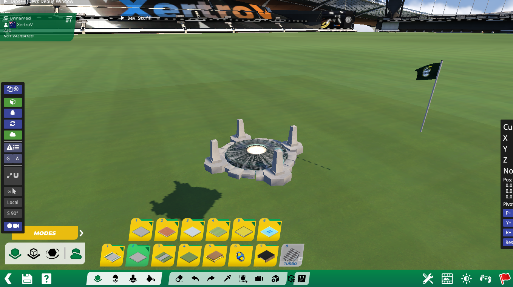

# Native collection validation — 2026-09-14

The collection regression exported both public items from `Test Exported items`
through Studio's real browser UI after changing the collection field to `26`.
Those downloads match byte-for-byte the same-parser copies that change only the
collection to numeric `26`.

After restarting TM2020, E++ MCP inspected and placed both browser exports in a
new Stadium map. A vanilla `Flag8m` control placed first. Item counts increased
from 0 → 1 → 2 → 3; both repairs resolved as stored collection `26`, runtime
collection `Stadium`, index `9`. The test map saved to disk and reopened with
all three items present.

| Browser export | SHA-256 | Editor observation |
| --- | --- | --- |
| `CustomItem_Static.Item.Gbx` | `4df6ffa1ba68a30633679d2cacb7b19bbfb06148ee00ddc68eab7bf495505ee2` | Placed and visibly rendered |
| `CustomItem_Kinematic.Item.Gbx` | `1bf9d3f3e699ceba2699646bf9606012b1233cac28238d362800312ea396a023` | Placed, but only an anchor marker was visible; animation/rendering remains unverified |

This is evidence for collection preservation/resolution and placement, not a
claim that all native save/exit or kinematic-rendering problems are fixed.
Earlier placement attempts before the restart failed even with numeric-only
repairs. A newly created byte-identical copy also failed placement in the new
session, so file/session registration must be distinguished from archive content.
No private assets appear in the screenshot or these tests.
