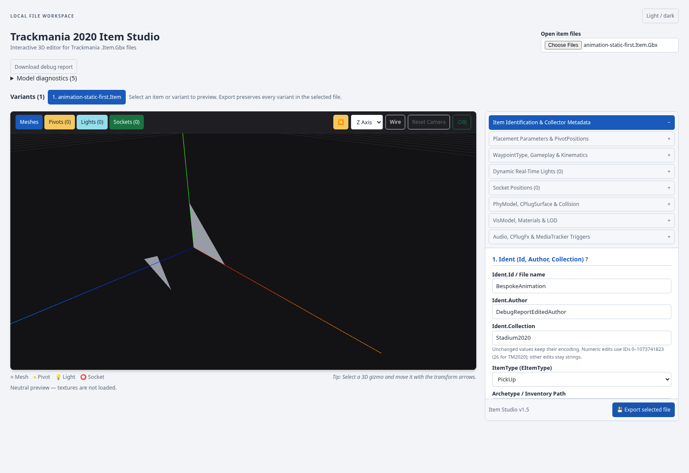
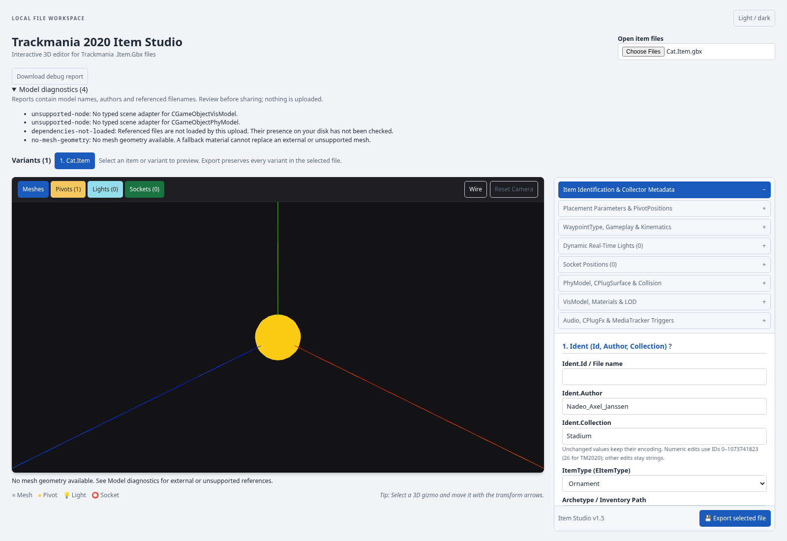

# Model diagnostics and neutral preview

**Download debug report** exports a local JSON snapshot of the current selection.
It works before upload and after an import failure as well as with a loaded
model. **Model diagnostics** expands the warnings without opening developer tools.

The viewer currently does not load game textures. Available mesh geometry uses
a neutral, lit matte material, with a visible `textures-not-loaded` notice.
Collision overlays keep their existing distinct styling. This is a fallback
preview, not an approximation of the original game material.

If no mesh geometry was loaded, the UI says so even when a pivot is visible.
It does not draw a placeholder mesh or imply that replacing a texture will
recover missing geometry. Legacy references such as Cat's `Meshes\Cat.Mesh.gbx`
are inventoried as **not loaded**, not falsely reported as absent from disk.
This change does not add external-dependency upload, texture decoding, network
fetches, or conversion of old-game item formats.

## Automation API

From the running page's developer console or Playwright:

```js
const report = await window.studioDebug.getReport();
console.table(report.dependencies);
console.table(report.diagnostics);
console.log(report.viewer.runtime);

// Same download as the UI button:
await window.studioDebug.downloadReport();
```

For an agent driving a browser:

```js
const report = await page.evaluate(() => window.studioDebug.getReport());
```

No socket/server or hidden upload is involved. Requests inspect current parsed
model state, not a cached report. The bridge is independent of viewer lifetime,
so a failed upload cannot return the previous model's identity/dependencies.
It is unregistered when the page component is disposed.

Schema version 1 includes:

- Current selection/views, typed collection identity, item kind and import/export error.
- Parser informational/assembly versions and module ID, since development DLLs can share a version number.
- Viewer mesh/vertex/triangle/gizmo counts and current renderer camera, colors, layer and playback state.
- Typed node inventory, materials, LOD mappings, collision status and diagnostics.
- Legacy string-based mesh/shape references and GBX reference-table filenames.
- Output limits and totals so truncated inventories are identifiable.

Raw GBX bytes, vertex buffers, textures and live object handles are excluded.
Reports **can contain private model names, authors and referenced filenames**;
review them before sharing. Automatic console warnings contain only diagnostic
codes, prefixed `[TMIS]`; detailed reports require an explicit request.

## Verification

```bash
npm ci --prefix Tests/Browser
npm --prefix Tests/Browser run test:debug-export
```

The command freshly publishes and serves this checkout on an isolated ephemeral
localhost port. It checks real upload → live report → JSON download, current
identity edits, actual rendered fallback colors, the unresolved Cat reference,
and failed-upload reset. Before/after item downloads must be byte-identical
across diagnostic requests. Existing viewer lifecycle and typed-viewer tests
also run against that same fresh server.

The initial regression failed on the absent download control. The implemented
path passes without page errors. Cat is the explicitly approved external-mesh
test item; the neutral-preview triangles are the existing bespoke fixture.




